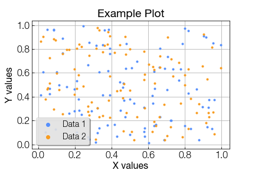

# plotsettings :art: :chart_with_upwards_trend:

Plot settings for uniform figures in group publications.

## Installation

1. `git clone git@github.com:McMahonCosmologyGroup/plotsettings.git`
2. `cd plotsettings/`
3. `python3 setup.py install --user`

## Usage
In jupyter notebook or python script:

```python3
import matplotlib
import matplotlib.pyplot as plt
import matplotlib.font_manager as font_manager

plt.style.use('path/to/repo/plotsettings/plotsettings/matplotlibrc_lab')

font_manager.fontManager.addfont(
    "path/to/repo/plotsettings/fonts/Helvetica-Neue-Light.ttf"
)
matplotlib.rcParams["font.family"] = "Helvetica Neue"
%config InlineBackend.figure_format = 'retina'
```

In your Jupyter notebook, consider adding:
```python3
%config InlineBackend.figure_format = 'retina'
```

## Example Figures with Configured settings

Code:
```python3
import matplotlib.pyplot as plt
plt.style.use('path/to/repo/plotsettings/matplotlibrc_lab')

import numpy as np
y1 = np.random.random(100)
y2 = np.random.random(100)
x = np.random.random(100)

plt.figure()
plt.title("Example Plot")
plt.xlabel("X values")
plt.ylabel("Y values")
plt.plot(x,y1,'.',label = 'Data 1')
plt.plot(x,y2,'.',label = "Data 2")
plt.legend()
plt.savefig("simple.png")
plt.show()
```

Output:
<p align="center">
     
</p>

## Dependencies
- matplotlib
- setuptools
- Python>=3.7

## Contributing
To alter the plotting settings, change the setting in the `matplotlibrc_lab` and uncomment the line.
